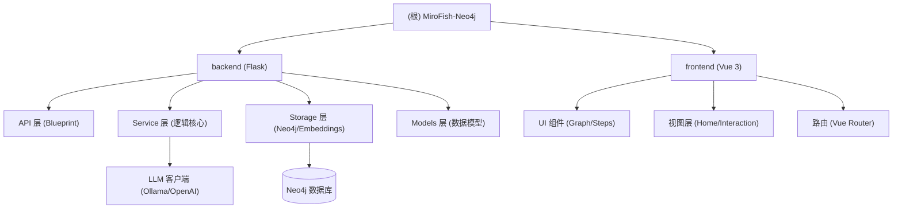

# MiroFish-Neo4j 架构文档

## 变更记录 (Changelog)
- **2026-03-24**: 初始化项目架构文档，识别后端 (Python/Flask) 与前端 (Vue 3/Vite) 模块。

## 项目愿景
MiroFish-Neo4j 是一个基于 Neo4j 和大语言模型 (LLM) 的知识图谱构建与管理系统。它旨在实现本地优先的群体智能引擎，通过自动化本体生成、多步检索推理等技术，将非结构化文档转化为可查询、可推理的图谱知识库。

## 架构总览

## 模块索引

| 模块路径 | 语言 | 职责描述 | 入口文件 |
| :--- | :--- | :--- | :--- |
| [backend](./backend/CLAUDE.md) | Python | 后端 API、图谱构建服务、LLM 链条管理、Neo4j 交互 | `backend/run.py` |
| [frontend](./frontend/CLAUDE.md) | Vue/JS | 用户界面、图谱可视化 (D3.js)、项目流程管理 | `frontend/src/main.js` |

## 运行与开发

### 环境要求
- Node.js >= 18.0.0
- Python >= 3.10
- Neo4j 数据库
- Ollama (可选，用于本地运行 LLM)

### 快速启动
1. **安装依赖**: `npm run setup:all` (会自动执行 root, backend 和 frontend 的安装)
2. **启动开发服务**: `npm run dev` (同时启动后端 5001 和前端)
3. **配置文件**: 在根目录或 `backend` 目录下创建 `.env` 文件。

## 测试策略
- **当前状态**: 暂未发现自动化测试。
- **建议**:
  - 后端引入 `pytest` 进行 API 与 Service 逻辑测试。
  - 前端引入 `vitest` 进行组件与 API 客户端测试。

## 编码规范
- **后端**: 遵循 PEP 8 规范，使用类型提示 (Type Hints)。
- **前端**: Vue 3 组合式 API (Composition API)，ESLint + Prettier。

## 规范图谱核心模型 (Normative KG Schema)

针对工程规范文档（如 GB 50054），采用**领域专用规范图谱**模型。

### 1. 节点类型 (8 类)
- **Section**: 章节层级。
- **Clause**: 最小可执行单元（带编号条款）。
- **Term**: 术语定义。
- **Component**: 实体对象（设备、系统、材料）。
- **Condition**: 前提条件（环境、场景）。
- **Action**: 规范要求的具体动作/措施。
- **Requirement**: 强制/推荐/禁止标签。
- **Parameter**: 表格/公式数值。

### 2. 边类型与情景驱动逻辑
- **defines**: 术语定义。
- **has_condition**: 条款的前提条件。
- **mandates / recommends / prohibits**: 强制/推荐/禁止动作。
- **in_situation**: 情景直接关联动作。
- **requires**: 动作满足的具体参数。
- **核心逻辑**: `Condition` —**under_condition**→ `Clause` —**mandates**→ `Action`

### 3. 构建流程
- **预处理**: 保留 metadata 溯源。
- **抽取**: 正则识别章节术语；LLM 识别条件、动作与参数。
- **关系**: 扫描“在…时”等句式建立条件关联；表格行拆解为参数节点。

## AI 使用指引
- 该项目涉及复杂的图谱构建逻辑 (`backend/app/services/graph_builder.py`) 和多步检索逻辑 (`backend/app/api/graph.py` 中的 `ai_qa`)。修改这些部分时，请确保理解其背景任务 (Background Workers) 和状态机转换。
- **核心模型应用**: 必须严格遵循上述 **Normative KG Schema** 进行实体提取和建模，以支持“遇到什么情况应该怎么做”的情景化查询。
