# Knowledge EviGraph
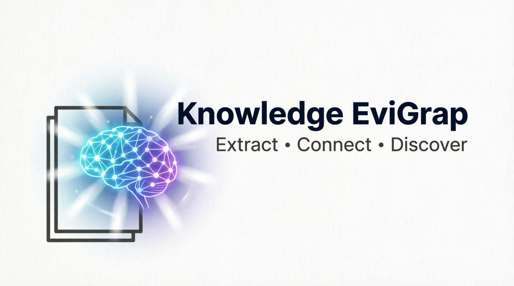![img.png]

基于 Neo4j 和大语言模型 (LLM) 的知识图谱构建与管理系统。将非结构化文档（如 PDF 工程规范）转化为可查询、可推理的图谱知识库，支持意图匹配检索、AI 问答、图谱可视化等核心能力。

## 技术栈

| 层级 | 技术 |
| :--- | :--- |
| 后端 | Python 3.10+ / Flask |
| 前端 | Vue 3 / Vite / D3.js |
| 数据库 | Neo4j 5.x |
| LLM | OpenAI SDK 兼容（Azure OpenAI / DashScope / vLLM / Ollama） |
| 嵌入模型 | Nomic Embed / DashScope text-embedding-v4 |
| 重排模型 | BGE-reranker-v2-m3 |
| PDF 解析 | MinerU（可选，支持 OCR） |

## 快速开始

### 环境要求

- Node.js >= 18.0.0
- Python >= 3.10
- Neo4j >= 5.26 数据库

### 安装依赖

```bash
npm run setup:all    # 自动安装 root、backend 和 frontend 依赖
```

### 配置环境变量

```bash
cp .env.example .env
# 编辑 .env，填入你的 API Key 和数据库连接信息
```

### 启动开发服务

```bash
npm run dev          # 同时启动后端 5001 和前端 Vite dev server
```

## 核心功能

### 1. 文档智能解析与分块
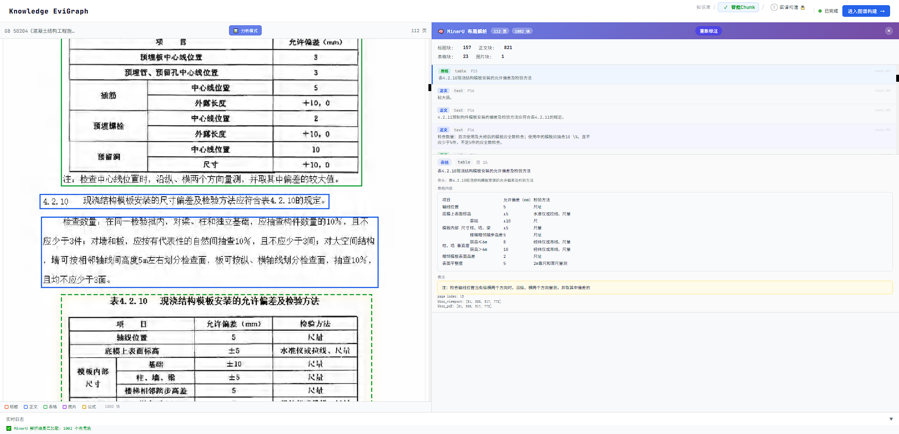

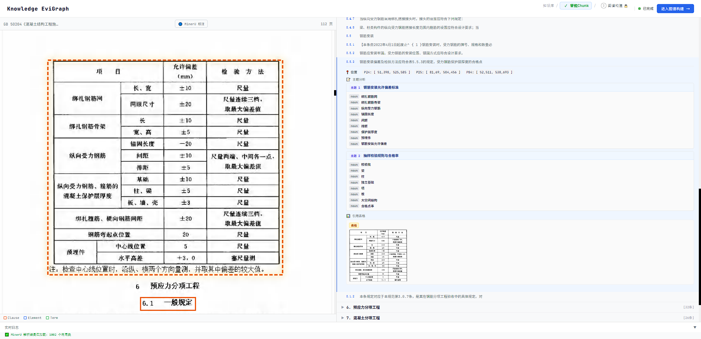
支持多种 PDF 解析策略，将非结构化文档转化为结构化知识。

| 功能 | 说明 |
| :--- | :--- |
| MinerU 解析 | 并发解析 PDF 每页，输出 `mineru_parsed.jsonl` |
| 智能分块 | LLM 驱动语义分块，识别章节、条款、实体、三元组 |
| 层级分块 | 基于正则的章节 → 条款 → 要素三级分块 |
| JSONL 支持 | 条款解析直接读取 JSONL 格式 |

### 2. 知识图谱构建

将解析后的文档内容写入 Neo4j 图谱，形成可检索的知识网络。
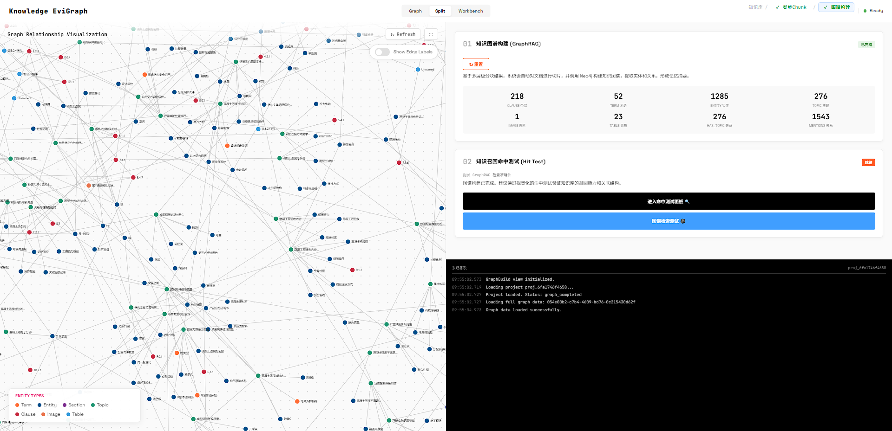

**实际写入的节点类型（8 类）**：
- `Clause` — 最小可执行单元（带编号条款）
- `Term` — 术语定义
- `Entity` — 知识实体
- `Parameter` / `Table` / `Image` — 数值/表格/图片节点

**实际创建的边类型（核心只有两种）**：
- `MENTIONS` — Topic → Entity / Topic → Term / Episode → Clause / Clause → Table / Clause → Image
- `HAS_TOPIC` — Clause → Topic

> 条件触发边（数据满足时生成）：`DEFINES`、`PART_OF`、`CROSS_REFERENCE`

### 3. 检索与 AI 问答

**检索路径**：
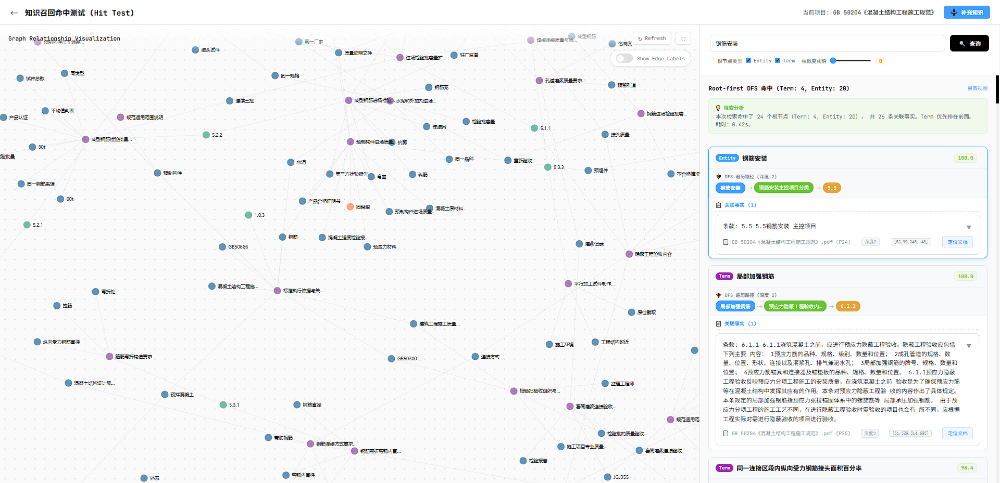
```
查询 → clause_id 精确匹配
      → Entity/Term/Clause 向量并行召回
      → fallback: Topic hybrid 召回 → Entity 映射
      → 路径: Entity/Term ←MENTIONS-- Topic ←HAS_TOPIC-- Clause
      → BGE-reranker 重排 → LLM 回答
```

**QA Pipeline** 统一整合了检索、分块、重排功能。

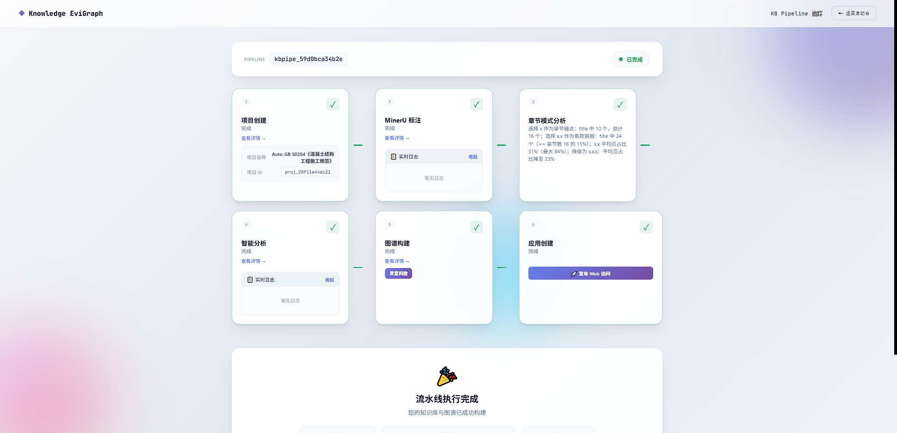

**AI 问答页面** (`/ai-qa`) 提供面向终端用户的智能问答体验：
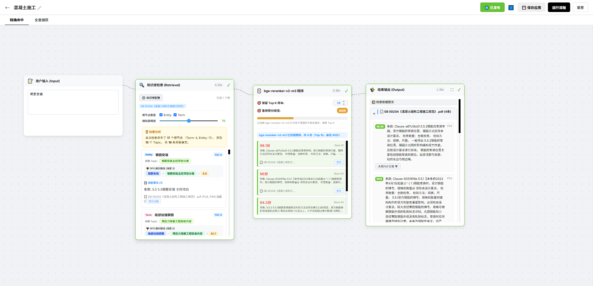

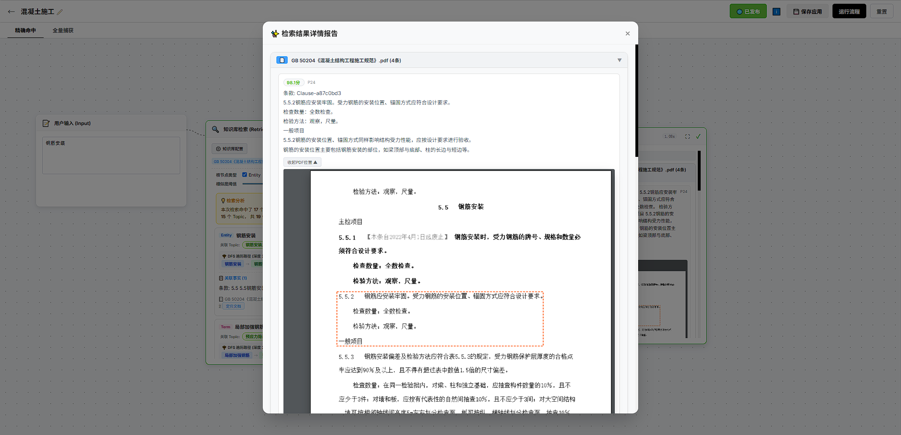

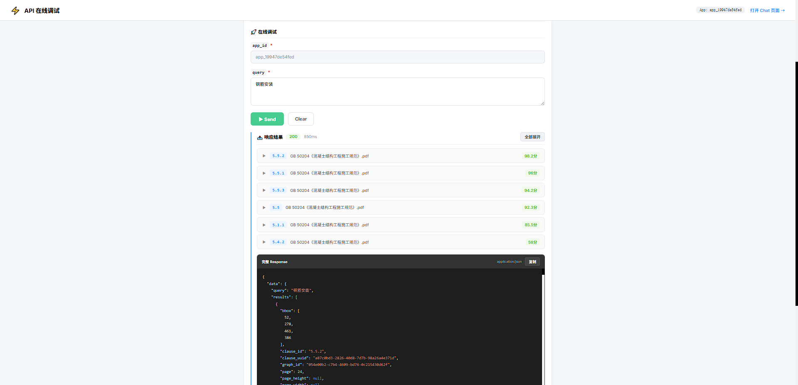
| 功能 | 说明 |
| :--- | :--- |
| 意图匹配 | 输入问题后自动识别查询意图，展示匹配到的 Topic、Entity 及其关联 Clause |
| 全量捕获 | 一键召回与问题相关的全部条款（含条款编号、内容、来源页码），支持 clause_id 去重 |
| 引用溯源 | 每个回答附带来源条款列表，可定位到具体章节与 PDF 页码 |
| 多轮对话 | 支持上下文连续追问，保留历史问答记录 |
| 报告生成 | 基于检索结果自动生成结构化分析报告，支持导出 |
| 应用隔离 | 通过 `app_id` 区分不同知识库配置，多项目/多规范独立问答 |

### 4. 图谱可视化与管理
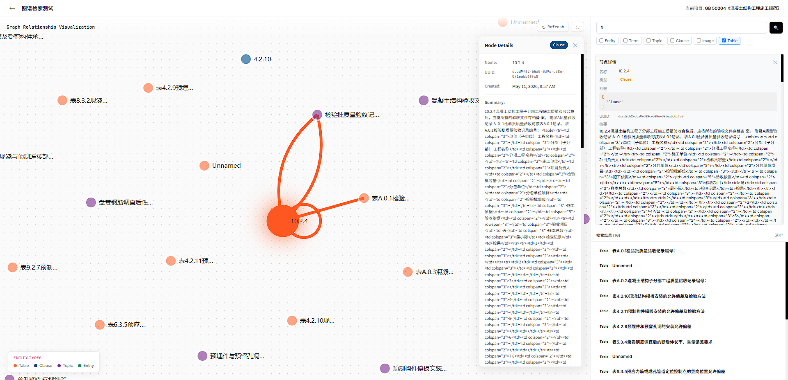

- **图谱检索测试页面** (`/graph-search/:projectId`)：节点类型多选 + 名称模糊搜索，动态加载 1 跳邻域，节点详情面板
- **AI 问答页面** (`/ai-qa`)：意图匹配 + 全量捕获
- **Chunk 分析页面**：展示条款关联实体、表格、图片的 base64 内容

### 4. 问答系统集成使用
- **知识问答系统** 这是商务单内容，使用Evi Graph的检索功能和pdf定位功能

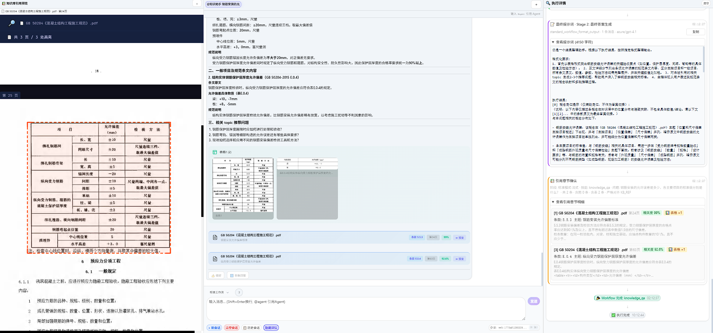
- 开发不易，欢迎打赏


## 项目结构

```
Knowledge EviGraph/
├── backend/                    # Flask 后端
│   ├── app/
│   │   ├── api/               # API 路由层 (Blueprint)
│   │   │   ├── graph.py       # 核心图谱接口
│   │   │   ├── graph_ops_routes.py   # 图谱操作（构建、数据查询）
│   │   │   ├── report.py      # 报告生成（检索、重排、LLM 问答工具）
│   │   │   ├── ai_app.py      # AI 应用配置与管理
│   │   │   ├── chunk_routes.py        # 文档智能分块
│   │   │   ├── ontology_routes.py     # 本体生成
│   │   │   ├── project_routes.py      # 项目管理
│   │   │   └── task_routes.py         # 异步任务状态
│   │   ├── services/          # 业务逻辑层
│   │   │   ├── graph_builder.py       # 图谱构建核心
│   │   │   ├── graph_tools.py         # 图谱工具集（重排、检索）
│   │   │   ├── qa_pipeline.py         # QA Pipeline 服务
│   │   │   ├── llm_driven_chunker.py  # LLM 驱动智能分块
│   │   │   └── ontology_generator.py  # 本体生成
│   │   ├── storage/           # 数据存储层
│   │   │   ├── neo4j_storage.py       # Neo4j 封装
│   │   │   └── search_service.py      # 检索服务（含 BGE-reranker）
│   │   └── models/            # 数据模型
│   ├── uploads/projects/      # 项目数据文件
│   └── run.py                 # 后端入口
├── frontend/                   # Vue 3 前端
│   ├── src/
│   │   ├── views/             # 页面视图
│   │   │   ├── PublicChatView.vue     # 公开问答
│   │   │   ├── IntentMatchView.vue    # 意图匹配
│   │   │   ├── ApiPlaygroundView.vue  # API 调试
│   │   │   ├── ChunkAnalysisView.vue  # Chunk 分析
│   │   │   └── GraphSearchView.vue    # 图谱检索
│   │   ├── api/               # API 客户端
│   │   └── main.js            # 前端入口
├── .env.example               # 环境变量示例（脱敏）
├── package.json               # root 脚本配置
└── README.md                  # 本文档
```

## API 路由速查

| 路由前缀 | 文件 | 说明 |
| :--- | :--- | :--- |
| `/api/graph` | `graph.py` | 核心图谱接口、后台 Worker |
| `/api/graph/ops` | `graph_ops_routes.py` | 图谱操作（构建、数据查询） |
| `/api/report` | `report.py` | 报告生成、检索、重排、问答 |
| `/api/ai-app` | `ai_app.py` | AI 应用配置与管理 |
| `/api/chunk` | `chunk_routes.py` | 文档智能分块 |
| `/api/ontology` | `ontology_routes.py` | 本体生成 |
| `/api/project` | `project_routes.py` | 项目管理 |
| `/api/task` | `task_routes.py` | 异步任务状态 |

## 环境变量说明

详见 [`.env.example`](./.env.example)，核心变量：

| 变量 | 说明 |
| :--- | :--- |
| `LLM_API_KEY` / `LLM_BASE_URL` / `LLM_MODEL_NAME` | 大语言模型配置 |
| `VLM_API_KEY` / `VLM_BASE_URL` / `VLM_MODEL_NAME` | 多模态模型配置 |
| `NEO4J_URI` / `NEO4J_USER` / `NEO4J_PASSWORD` | Neo4j 数据库连接 |
| `EMBEDDING_MODEL` / `EMBEDDING_BASE_URL` / `EMBEDDING_DIMENSION` | 嵌入模型配置 |
| `RERANKER_MODEL` / `RERANKER_BASE_URL` / `RERANKER_API_KEY` | BGE 重排模型配置 |
| `MINERU_API_URL` | MinerU PDF 解析服务地址 |
| `MINIO_ENDPOINT` / `MINIO_ACCESS_KEY` / `MINIO_SECRET_KEY` | MinIO 对象存储（可选） |
| `FRONTEND_URL` | 前端地址（用于生成客户端路由链接） |

## 启动脚本

位于 `script/` 目录：
- `mineru_start.sh` — 启动 MinerU PDF 解析服务
- `nomic_embed_start.sh` — 启动 Nomic Embedding 服务
- `vllm_start.sh` — 启动 vLLM LLM 服务

## 编码规范

- **后端**: PEP 8，使用类型提示 (Type Hints)
- **前端**: Vue 3 Composition API，ESLint + Prettier
