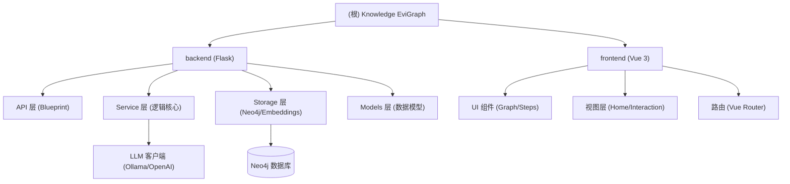

# Knowledge EviGraph 架构文档

## 变更记录 (Changelog)
- **2026-03-24**: 初始化项目架构文档，识别后端 (Python/Flask) 与前端 (Vue 3/Vite) 模块。

## 项目愿景
Knowledge EviGraph 是一个基于 Neo4j 和大语言模型 (LLM) 的知识图谱构建与管理系统。它旨在实现本地优先的群体智能引擎，通过自动化本体生成、多步检索推理等技术，将非结构化文档转化为可查询、可推理的图谱知识库。

## 架构总览



## 模块索引

| 模块路径 | 语言 | 职责描述 | 入口文件 |
| :--- | :--- | :--- | :--- |
| [backend](./backend/CLAUDE.md) | Python | 后端 API、图谱构建服务、LLM 链条管理、Neo4j 交互 | `backend/run.py` |
| [frontend](./frontend/CLAUDE.md) | Vue/JS | 用户界面、图谱可视化 (D3.js)、项目流程管理 | `frontend/src/main.js` |

## 运行与开发

### 环境要求
- Node.js >= 18.0.0
- Python >= 3.10
- Neo4j 数据库
- Ollama (可选，用于本地运行 LLM)

### 快速启动
1. **安装依赖**: `npm run setup:all` (会自动执行 root, backend 和 frontend 的安装)
2. **启动开发服务**: `npm run dev` (同时启动后端 5001 和前端)
3. **配置文件**: 在根目录或 `backend` 目录下创建 `.env` 文件。

## 测试策略
- **当前状态**: 暂未发现自动化测试。
- **建议**:
  - 后端引入 `pytest` 进行 API 与 Service 逻辑测试。
  - 前端引入 `vitest` 进行组件与 API 客户端测试。

## 编码规范
- **后端**: 遵循 PEP 8 规范，使用类型提示 (Type Hints)。
- **前端**: Vue 3 组合式 API (Composition API)，ESLint + Prettier。

## 规范图谱核心模型 (Normative KG Schema)

针对《低压配电设计规范》GB 50054-2011 的 chunks（已按 fitz_blocks/fitz_tables 拆解的文本块 + 表格），采用**领域专用规范图谱（Normative Knowledge Graph）**的节点-边模型。该模型既能支持**实体定义查询**（“什么是XX？”），又能支持**情景化决策查询**（“在XX情况下应该怎么做？”）。

### 1. 节点类型（Entities / Points）—— 8 类核心节点

| 节点类型 | 英文标签 | 示例（来自 chunks） | 作用 |
| :--- | :--- | :--- | :--- |
| **Section** | Section | “3 电器和导体的选择”、“7.6 电缆布线” | 章节层级结构 |
| **Clause** | Clause | “3.1.1 低压配电设计所选用的电器，应符合…” | 最小可执行单元（每一条带编号的条款） |
| **Term** | Term | “2.0.1 预期接触电压”、“2.0.4 间接接触” | 术语定义 |
| **Component** | Component | “隔离电器”、“矿物绝缘电缆”、“TN-C 系统” | 实体对象（设备、系统、材料） |
| **Condition** | Condition | “在TN-C系统中”、“屋内明敷”、“短路条件下” | 所有前提条件（环境、系统类型、场景） |
| **Action** | Action | “设置隔离电器”、“采取防火封堵”、“不应大于0.5m” | 规范要求的具体动作/措施 |
| **Requirement** | Requirement | “必须严格执行”、“严禁”、“宜”、“不应” | 强制/推荐/禁止标签（属性也可放这里） |
| **Parameter** | Parameter | “表7.6.20 最小净距”、“附录A 系数k值” | 表格/公式数值（行可拆为子节点） |

### 2. 边类型（Relations / Edges）—— 情景驱动连接

| 边类型 | 方向示例 | 语义含义 | 能回答的问题类型 |
| :--- | :--- | :--- | :--- |
| **defines** | Term → Clause<br>Clause → Term | 术语定义关系 | “什么是预期接触电压？” |
| **part_of** | Clause → Section<br>SubSection → Section | 层级包含 | 结构导航 |
| **applies_to** | Clause → Component | 该条款针对哪个设备/系统 | “隔离电器适用于哪些场合？” |
| **has_condition** | Clause → Condition | 该条款的前提条件（最重要！） | 情景查询起点 |
| **under_condition** | Condition → Clause（反向边） | 条件触发哪些条款 | “在TN-C系统中查所有条款” |
| **mandates** / **recommends** / **prohibits** | Clause → Action<br>Clause → Requirement | 强制/推荐/禁止动作（三条不同边） | “应该怎么做 / 严禁做什么” |
| **in_situation** | Condition → Action | 直接把“情景→动作”连起来 | “遇到XX情况→执行YY措施” |
| **requires** | Action → Component / Parameter | 动作需要满足的具体参数 | “敷设矿物绝缘电缆的最小弯曲半径？” |
| **references** | Clause → Clause<br>Clause → external_standard | 条款间引用、引用其他国标 | 跨条款追踪 |
| **has_value** | Parameter → Component<br>Parameter → Condition | 表格数值绑定实体/条件 | 数值查询 |

**核心“情景驱动”逻辑：**
- `Condition` —**under_condition**→ `Clause` —**mandates**→ `Action`

### 3. 具体构建流程

1. **Chunk 预处理**：保留 metadata（page、bbox）作为 Clause/Parameter 的属性。表格 chunk 单独解析。
2. **实体抽取 (Node)**：正则+关键词匹配章节号、术语编号、表号。使用领域词表辅助抽取。
3. **关系抽取 (Edge)**：
   - **定义类**：以“2.0.x”开头的 chunk 建立 `Term` + `defines` 边。
   - **条件-动作类**：扫描“在…时”、“当…情况下”、“应…”、“不应…”等句式，建立 `has_condition` + `mandates` 边。
   - **表格类**：表标题 → `Parameter`；表头列 → `Condition`；每一行 → `has_value`。
   - **引用类**：识别“符合表X.X”、“按…执行”建立 `references`。
4. **图谱属性 (Properties)**：
   - `Clause`: `severity` (必须/应/宜/严禁), `page`, `source_chunk_id`
   - `Action`: `action_type` (选择、安装、保护、敷设…)

## AI 使用指引
- 该项目涉及复杂的图谱构建逻辑 (`backend/app/services/graph_builder.py`) 和多步检索逻辑 (`backend/app/api/graph.py` 中的 `ai_qa`)。修改这些部分时，请确保理解其背景任务 (Background Workers) 和状态机转换。

## 多层级分块流程 (Hierarchical Chunking)

该系统采用**三级分块策略**，将工程规范文档（PDF）转化为结构化知识图谱。

### 流程总览

```mermaid
graph LR
    PDF[PDF 文档] -->|文本提取| Parser["FileParser<br/>文本块 + 表格 + OCR"]
    Parser -->|TextChunk[]| Chunker["HierarchicalChunker<br/>三级分块"]
    Chunker -->|HierarchicalChunkResult| Storage["Neo4jStorage<br/>Episode + Entity + Relation"]
    Storage --> Neo4j[("Neo4j 图谱")]
```

### 第一层：文本提取 (FileParser)

**文件**: `backend/app/utils/file_parser.py`

| 方法 | 功能 |
|------|------|
| `_extract_chunks_from_pdf()` | 使用 PyMuPDF (fitz) 提取每页文本块和表格 |
| `_perform_ocr_with_bboxes()` | 对图像密集页面执行 Tesseract OCR |
| `_extract_chunks_with_pypdf()` | 降级方案：使用 pypdf 提取文本 |

**TextChunk 数据结构**:
```python
@dataclass
class TextChunk:
    text: str                    # 文本内容
    metadata: Dict[str, Any]     # 元数据
        # - source: 文件名
        # - page: 页码
        # - type: "pdf" | "table"
        # - bbox: [x0, y0, x1, y1] 边界框
        # - page_width, page_height: 页面尺寸
```

### 第二层：多层级分块 (HierarchicalChunker)

**文件**: `backend/app/services/hierarchical_chunker.py`

#### Level-1: 章节级 (SectionSegment)
- **识别模式**: `第X章`、`X.Y 标题`
- **正则**: `CHAPTER_PATTERN`, `SECTION_PATTERN`
- **输出**: 章节名称、章节编号、完整内容

#### Level-2: 条文级 (ClauseSegment)
- **识别模式**: `X.Y.Z 条款内容`
- **正则**: `CLAUSE_ID_PATTERN`
- **提取信息**:
  - 条文编号 (e.g., `3.1.1`)
  - 条文标题
  - 款/项内容 (e.g., `3.1.1.1 第一款...`)
  - 公式引用 (e.g., `公式3.2.14`)
  - 表格引用 (e.g., `表3.2.9`)
  - 适用系统 (e.g., `TN-C系统`, `TT系统`)
  - 要求类型 (`MANDATORY`/`RECOMMENDED`/`PROHIBITED`)
  - 交叉引用 (e.g., `见5.2.9`)

#### Level-3: 要素级 (ElementSegment)
- **识别模式**: 表格行、术语定义、公式
- **正则**: `TABLE_ROW_PATTERN`, `TERM_PATTERN`, `FORMULA_REF_PATTERN`
- **要素类型**: `TABLE_ROW`, `FORMULA`, `TERM`, `PARAMETER`

#### 数据结构

```python
@dataclass
class HierarchicalChunk:
    id: str                      # 稳定ID (e.g., "CL3_1_2_3")
    level: ChunkLevel            # LEVEL_1 / LEVEL_2 / LEVEL_3
    content: str                 # 条文/章节内容
    metadata: Dict[str, Any]     # 额外元数据
    source: Optional[str]        # 文档来源文件名
    page: Optional[int]          # 页码

@dataclass
class ClauseSegment(HierarchicalChunk):
    clause_id: str               # 条文编号
    clause_title: str           # 条文标题
    paragraphs: List[str]        # 款/项内容
    formula_id: Optional[str]    # 公式编号
    table_refs: List[str]       # 引用的表格
    applicable_systems: List[SystemApplicability]  # 适用系统
    requirement_type: RequirementType  # MANDATORY/RECOMMENDED/PROHIBITED
    cross_refs: List[CrossReference]  # 交叉引用
```

### 第三层：Neo4j 存储 (Neo4jStorage)

**文件**: `backend/app/storage/neo4j_storage.py`

#### 存储逻辑

| 存储内容 | 方法 | Neo4j 节点/关系 |
|----------|------|------------------|
| 原始文本块 | `add_hierarchical_chunk_with_entities()` | `:Episode` 节点 (data, source, page, bbox) |
| 条文实体 | `_create_entity_for_clause()` | `:Entity:Clause` 节点 (name, summary) |
| 章节实体 | `_create_section_entity()` | `:Entity:Section` 节点 |
| 要素实体 | `_create_element_entity()` | `:Entity:Formula/Parameter/Term` 节点 |
| 引用关系 | `build_cross_ref_relations()` | `:RELATION{name:'REFERENCES'}` |
| 层级关系 | `build_hierarchical_relations()` | `:RELATION{name:'PART_OF'}` |

#### Episode 节点结构

```cypher
(:Episode {
    uuid: String,           // 稳定UUID (基于graph_id + content生成)
    graph_id: String,       // 所属图谱ID
    data: String,           // 原始文本内容
    source: String,         // 来源文件名
    page: Integer,          // 页码
    processed: Boolean,      // 是否已处理
    embedding: Float[],      // 向量嵌入
    metadata_json: String    // JSON格式元数据
})
```

#### Entity 节点结构

```cypher
(:Entity:Clause {
    uuid: String,           // UUID
    graph_id: String,
    name: String,           // e.g., "条款3.1.1"
    name_lower: String,     // 小写名称 (用于MERGE)
    summary: String,        // 内容摘要 (前500字符)
    embedding: Float[],
    attributes_json: String,
    created_at: DateTime
})
```

#### Episode → Entity 关系

```cypher
(:Episode)-[:MENTIONS {
    graph_id: String
}]->(:Entity)
```

### 检索与文档定位

检索结果通过以下流程实现文档定位：

1. **检索**: `searchGraph()` → 返回 `facts` 列表
2. **来源追溯**: 每个 fact 关联 `episode_ids`
3. **获取位置**: `get_episodes()` → 提取 `source` 和 `page`
4. **前端展示**: HitTest 页面显示"定位文档"按钮

```python
# graph_tools.py 搜索结果构建
fact_obj = {
    "uuid": edge_uuid,
    "text": fact,              # 关系描述
    "source": "低压配电设计规范.pdf",  # 来源文件
    "page": 42,               # 页码
    "bbox": [x0, y0, x1, y1],  # 边界框
    "graph_id": graph_id,
    "source_node_uuid": src_uuid,
    "target_node_uuid": tgt_uuid
}
```

### 向量索引与全文索引

系统支持两种检索方式：

| 索引类型 | Neo4j 索引名 | 用途 |
|----------|--------------|------|
| 向量索引 | `entity_embedding`<br>`episode_embedding`<br>`fact_embedding` | 语义相似度搜索 (需要 Neo4j 5.11+) |
| 全文索引 | `entity_fulltext`<br>`episode_fulltext`<br>`fact_fulltext` | 关键词/BM25 搜索 |

**降级策略**: 当向量索引不可用时，自动回退到全文搜索。

### 正则模式速查表

| 模式 | 正则 | 示例 |
|------|------|------|
| 条文编号 | `(\d+\.\d+\.\d+)` | `3.1.1`, `7.6.20` |
| 公式引用 | `公式[\(（]?(\d+\.\d+(?:-\d+)?)` | `公式3.2.14`, `式(7.2.1-1)` |
| 表格引用 | `(?:表[\s　]*\|见表\s*)(\d+\.\d+)` | `表3.2.9`, `见表7.6.20` |
| 适用系统 | `(TN\|TT\|IT)(?:-C\|-S\|-C-S)?` | `TN-C`, `TT`, `IT` |
| 强制性标识 | `(?:必须\|应\|严禁\|不得)` | `必须`, `应不`, `严禁` |

